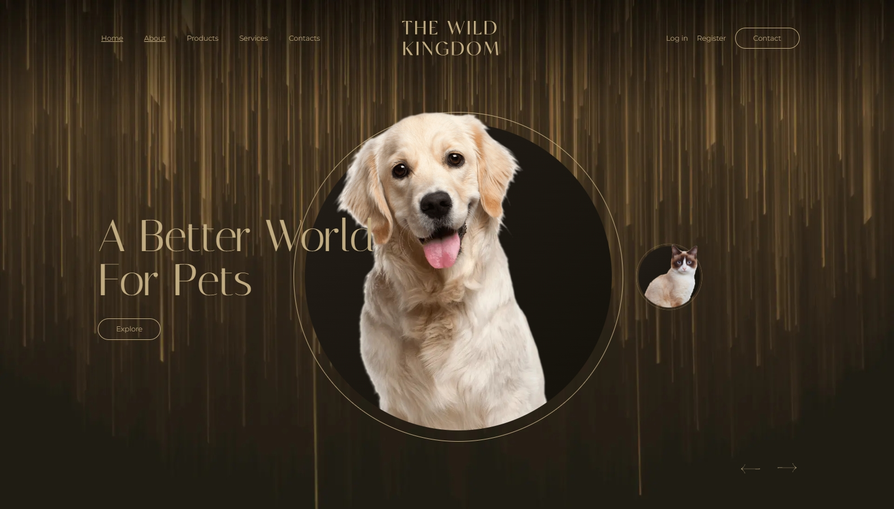

# This landing page is designed based on a working template.

___LAYOUT FEATURES:___

* Layout made on Figma
* HTML using BEM methodology
* Fully responsive layout up to 360px width
* No use of any preprocessors and assemblers (manual work)
* Hamburger menu on mobile devices
* Swiper sliders
* Parallax effect
* Smooth scrolling to a section from a menu item
* Animation
* Decreasing header when scrolling
<<<<<<< HEAD
* Contacts form
* Gallery

 **_The result of the work can be viewed at the link:_**  ➡️ [Link to the layout Page](https://vjacheslav250.github.io/The-Wild-Kingdom/#)

  

 
 
     
 
 

=======
contacts form
* The result of the work can be viewed at the link: ➡️ [Link to the layout Page](https://vjacheslav250.github.io/The-Wild-Kingdom/#)
  
>>>>>>> 90ee387d31bf3b69fb9b255b24c65d7274cd2f5e
